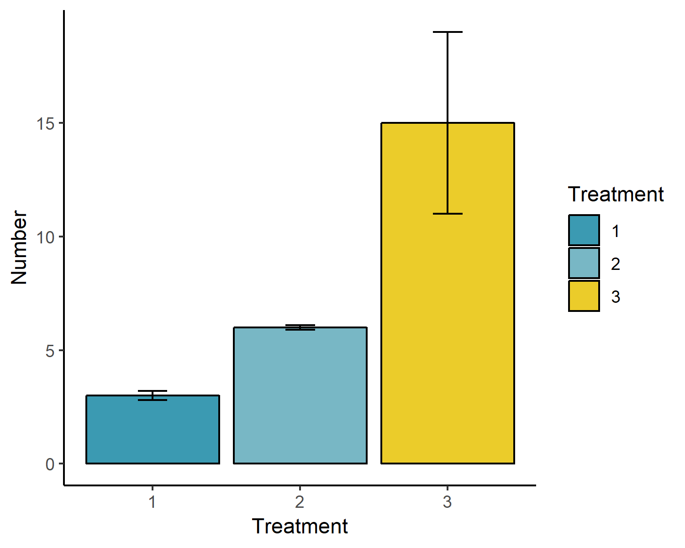

```{r message=FALSE, warning=FALSE, include=FALSE}
library(tidyverse)
library(flextable)
```


## Authors

#### Brendan S. Lanham^1,a^ \


^1^Centre for Marine Science and Innovation, School of Biological, Earth and Environmental Science, University of New South Wales, Sydney, NSW Australia.\


^a^Corresponding author - email: brendan.lanham@unsw.edu.au \
\

## Abstract
Blah blah blah yadda yadda yadda 
\

**Keywords: rStudio; rmarkdown; word sucks; etc**


##### Introduction

Lots of writing here that most people will skim over. You might want to put some of it in *italics* and some of it in **bold for some reason**. It's also important to use references [@Lanham2018]. 


## Materials and Methods

### Third order heading
Deets on experiment one. The sampling area was 24 km^2^. I think this does ~subscript~ 

### Another section subheading
Deets on experiment 2 and here you might want to hyperlink ([www.seagis.com](https://www.seagis.com.au))


## Results

### Results from experiment one
Species one, *V. cool* was more abundant in the ocean in contrast to the land (Table 1).

### Results from experiment two

```{r collecttable, echo=FALSE, message=FALSE, warning=FALSE}
Collection_methods <- tibble("Method" = c("Not clearly described", "Manually collected",
                                              "Pump", "Donated from WWTP", "Nets", "Sieve stacks",
                                              "Autosample", "Grab sampler", "Core sampler",
                                              "Portable sampler", "Manta trawl"),
                                 "Number of studies" = c(15,12,8,4,3,2,2,2,1,1,1))

coltab <- flextable(Collection_methods) %>% 
  colformat_num(col_keys=c("Number of studies"), digits=0) %>%
  align(j = 1, align = "left", part = "all") %>%
  font(fontname = "Times New Roman", part = "all") %>%
  padding(padding=1) %>%
  autofit()
coltab
```

## Discussion

Heaps more text.


## Figures





## Literature cited 


<!-- ```{r} -->
<!-- library(wesanderson) -->
<!-- plot <- tibble(Treatment = c("1", "2", "3"), -->
<!--                mean = c(3, 6, 15), -->
<!--                se   = c(0.2, 0.1, 4)) %>% -->
<!--   ggplot(aes(x=Treatment, y=mean, fill = Treatment)) + -->
<!--   geom_col(colour = "black") + geom_errorbar(aes(ymin=mean-se, ymax=mean+se), width = 0.2) + -->
<!--   scale_fill_manual(values = wes_palette("Zissou1")) + -->
<!--   labs(y="Number") + -->
<!--   theme_classic() -->
<!-- plot -->

<!-- ggsave("../figures/path.png", plot, width = 5, height = 4) -->
<!-- ``` -->


